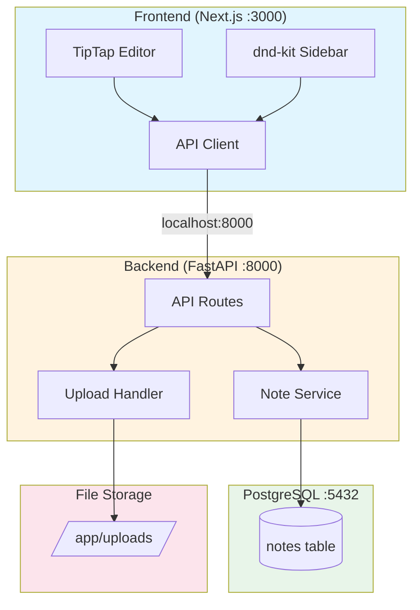
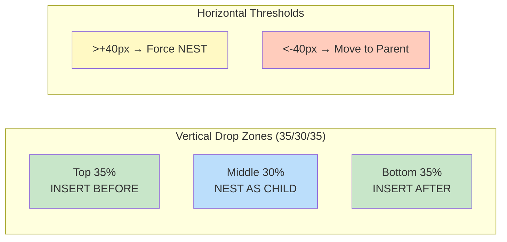
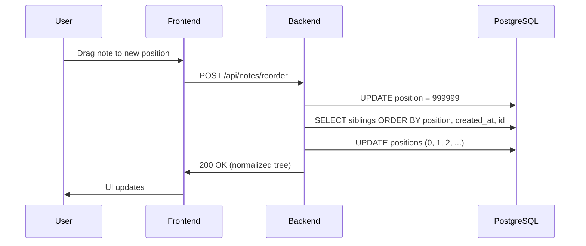

# visualization

Generate architecture diagrams, mindmaps, and audit status infographics using Mermaid.

## Usage

When this skill is invoked with "diagram", "visualize", or "architecture", generate the appropriate Mermaid source.

## Templates

### 1. Architecture Diagram

Generate to: `docs-by-notebooklm/generated/architecture.mmd`



### 2. Drag-and-Drop Zones Diagram

Generate to: `docs-by-notebooklm/generated/dnd-zones.mmd`



### 3. Data Flow Diagram

Generate to: `docs-by-notebooklm/generated/data-flow.mmd`



### 4. Audit Status Infographic

Generate to: `docs-by-notebooklm/generated/audit-status.mmd`


## Output Locations

All generated diagrams go to: `docs-by-notebooklm/generated/`

| Diagram | Filename |
|---------|----------|
| Architecture | `architecture.mmd` |
| DnD Zones | `dnd-zones.mmd` |
| Data Flow | `data-flow.mmd` |
| Audit Status | `audit-status.mmd` |

## Rendering (if tools available)

```bash
# If mermaid-cli is installed
mmdc -i docs-by-notebooklm/generated/architecture.mmd -o docs-by-notebooklm/generated/architecture.svg

# If not installed, Mermaid sources can be rendered via:
# - GitHub markdown preview
# - https://mermaid.live
# - VS Code Mermaid extension
```

## When to Use
- Documenting architecture for new team members
- Creating presentations
- Audit reports
- README documentation
