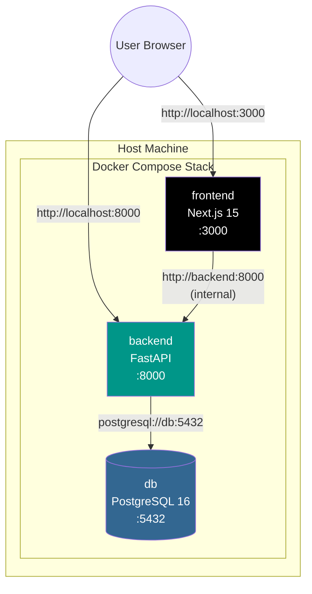

# VISUALIZATION_SKILL_DRAFT.md

## Skill Specification: System Visualization Generator

Version: 1.0.0-draft
Generated: 2024-12-24

---

## Overview

This document describes a Claude Code **Agent Skill** that auto-generates visualizations reflecting the Notes Dashboard system state. The skill produces architecture diagrams, audit status infographics, and exportable slide decks/PDFs.

---

## Skill Definition

### SKILL.md

```yaml
---
name: system-visualization
description: Auto-generate architecture diagrams (Mermaid), audit status infographics, and slide decks/PDFs reflecting Notes Dashboard system state. Use when the user asks for system diagrams, architecture visualizations, audit reports, or documentation exports.
allowed-tools: Read, Glob, Grep, Bash, Write
---

# System Visualization Generator

## Purpose
Generate visual documentation of the Notes Dashboard application including:
- Architecture diagrams (Mermaid format)
- Audit status infographics
- Slide deck exports
- PDF reports

## Capabilities

### 1. Architecture Diagrams
Generate Mermaid diagrams for:
- Container network topology
- API endpoint flow
- Database schema relationships
- Drag-and-drop interaction flow

### 2. Audit Status Infographics
Parse test results and generate:
- Pass/fail status badges
- Test coverage summaries
- Compliance matrices

### 3. Export Formats
- Markdown with embedded Mermaid
- HTML slide decks (reveal.js compatible)
- PDF via Markdown-to-PDF conversion

## Usage Examples

### Generate Architecture Diagram
User: "Create a diagram of the backend services"
Action: Read relevant files, generate Mermaid flowchart

### Generate Audit Report
User: "Show me the current test status as an infographic"
Action: Run pytest, parse output, generate status visualization

### Export Documentation
User: "Create a slide deck of the system architecture"
Action: Generate multi-slide Markdown with Mermaid diagrams
```

---

## Skill Directory Structure

```
.claude/skills/system-visualization/
├── SKILL.md                    # Main skill definition
├── templates/
│   ├── architecture-diagram.md # Mermaid template for architecture
│   ├── audit-status.md         # Status badge template
│   ├── slide-deck.md           # Reveal.js slide template
│   └── pdf-report.md           # PDF-ready Markdown template
├── scripts/
│   ├── parse-pytest-output.py  # Parse pytest JSON output
│   ├── generate-mermaid.py     # Generate Mermaid from codebase
│   └── export-pdf.sh           # Markdown to PDF conversion
└── examples/
    ├── container-diagram.md    # Example container network diagram
    └── sample-audit-report.md  # Example audit status report
```

---

## Template: Architecture Diagram

### templates/architecture-diagram.md

```markdown
# Notes Dashboard Architecture

## Container Network

\`\`\`mermaid
graph TB
    subgraph "Docker Network"
        subgraph "Frontend Container"
            F[Next.js 15<br/>Port 3000]
        end

        subgraph "Backend Container"
            B[FastAPI<br/>Port 8000]
        end

        subgraph "Database Container"
            D[(PostgreSQL 16<br/>Port 5432)]
        end
    end

    Browser((Browser)) -->|:3000| F
    Browser -->|:8000| B
    F -->|http://backend:8000| B
    B -->|postgresql://db:5432| D

    style F fill:#0070f3,color:#fff
    style B fill:#009688,color:#fff
    style D fill:#336791,color:#fff
\`\`\`

## Data Flow

\`\`\`mermaid
sequenceDiagram
    participant U as User
    participant FE as Frontend
    participant BE as Backend
    participant DB as Database

    U->>FE: Drag note to new position
    FE->>FE: Calculate drop zone (35/30/35)
    FE->>BE: POST /api/v1/notes/{id}/reorder
    BE->>BE: Validate circular reference
    BE->>DB: Update position (temp 999999)
    BE->>DB: _normalize_positions()
    DB-->>BE: Commit success
    BE-->>FE: 200 OK + updated note
    FE-->>U: Re-render tree
\`\`\`
```

---

## Template: Audit Status

### templates/audit-status.md

```markdown
# System Audit Status

## Test Results Summary

| Category | Status | Details |
|----------|--------|---------|
| Backend Tests | {{BACKEND_STATUS}} | {{BACKEND_DETAILS}} |
| E2E Tests | {{E2E_STATUS}} | {{E2E_DETAILS}} |
| Lint | {{LINT_STATUS}} | {{LINT_DETAILS}} |

## Status Badges

\`\`\`
Backend: [{{BACKEND_PASS}}/{{BACKEND_TOTAL}} PASSING]
E2E:     [{{E2E_PASS}}/{{E2E_TOTAL}} PASSING]
\`\`\`

## Constitution Compliance

| Article | Invariant | Status |
|---------|-----------|--------|
| I.1.1 | _normalize_positions() single source | {{NORM_STATUS}} |
| I.1.2 | 0-indexed positions | {{ZERO_STATUS}} |
| I.2.3 | Recursion depth limit (100) | {{DEPTH_STATUS}} |
| II.1.1 | 35/30/35 drop zones | {{ZONE_STATUS}} |
| II.1.2 | 40px indent/outdent threshold | {{INDENT_STATUS}} |
```

---

## Template: Slide Deck

### templates/slide-deck.md

```markdown
---
title: Notes Dashboard System Overview
theme: white
revealOptions:
  transition: slide
---

# Notes Dashboard

## A Hardened Full-Stack Application

---

## Architecture

\`\`\`mermaid
graph LR
    FE[Frontend] --> BE[Backend]
    BE --> DB[(Database)]
\`\`\`

---

## Key Invariants

- **Position Management**: 0-indexed, normalized
- **Circular Reference Prevention**: Depth limit 100
- **Drop Zones**: 35/30/35 vertical strategy

---

## Test Coverage

| Suite | Status |
|-------|--------|
| Backend | {{BACKEND_STATUS}} |
| E2E | {{E2E_STATUS}} |

---

## Questions?

Contact: [Project Repository]
```

---

## Script: Generate Mermaid from Codebase

### scripts/generate-mermaid.py

```python
#!/usr/bin/env python3
"""
Generate Mermaid diagrams from Notes Dashboard codebase structure.
Analyzes file imports, API routes, and database models.
"""

import os
import re
import json
from pathlib import Path

def extract_api_routes(router_file: str) -> list[dict]:
    """Extract FastAPI routes from router file."""
    routes = []
    with open(router_file) as f:
        content = f.read()

    # Match @router.get/post/put/delete decorators
    pattern = r'@router\.(get|post|put|delete)\(["\']([^"\']+)["\']'
    for match in re.finditer(pattern, content):
        routes.append({
            'method': match.group(1).upper(),
            'path': match.group(2)
        })
    return routes

def generate_api_diagram(routes: list[dict]) -> str:
    """Generate Mermaid flowchart for API routes."""
    lines = ['graph LR']
    lines.append('    Client((Client))')

    for i, route in enumerate(routes):
        node_id = f'R{i}'
        lines.append(f'    {node_id}["{route["method"]} {route["path"]}"]')
        lines.append(f'    Client --> {node_id}')

    return '\n'.join(lines)

def main():
    # Find router files
    backend_path = Path('backend/app/routers')
    all_routes = []

    for router_file in backend_path.glob('*.py'):
        if router_file.name != '__init__.py':
            routes = extract_api_routes(str(router_file))
            all_routes.extend(routes)

    diagram = generate_api_diagram(all_routes)
    print(diagram)

if __name__ == '__main__':
    main()
```

---

## Script: Parse Pytest Output

### scripts/parse-pytest-output.py

```python
#!/usr/bin/env python3
"""
Parse pytest JSON output and generate status summary.
Run pytest with: pytest --json-report --json-report-file=report.json
"""

import json
import sys

def parse_pytest_report(report_path: str) -> dict:
    """Parse pytest JSON report and return summary."""
    with open(report_path) as f:
        report = json.load(f)

    summary = report.get('summary', {})
    return {
        'passed': summary.get('passed', 0),
        'failed': summary.get('failed', 0),
        'total': summary.get('total', 0),
        'duration': report.get('duration', 0),
        'status': 'PASS' if summary.get('failed', 0) == 0 else 'FAIL'
    }

def generate_badge(summary: dict) -> str:
    """Generate text badge for test status."""
    status_icon = '✅' if summary['status'] == 'PASS' else '❌'
    return f"{status_icon} {summary['passed']}/{summary['total']} PASSING"

if __name__ == '__main__':
    if len(sys.argv) < 2:
        print("Usage: parse-pytest-output.py <report.json>")
        sys.exit(1)

    summary = parse_pytest_report(sys.argv[1])
    print(json.dumps(summary, indent=2))
```

---

## Script: Export to PDF

### scripts/export-pdf.sh

```bash
#!/bin/bash
# Export Markdown to PDF using pandoc or similar tool
# Requires: pandoc, wkhtmltopdf or weasyprint

INPUT_FILE="$1"
OUTPUT_FILE="${2:-output.pdf}"

if [ -z "$INPUT_FILE" ]; then
    echo "Usage: export-pdf.sh <input.md> [output.pdf]"
    exit 1
fi

# Check for pandoc
if command -v pandoc &> /dev/null; then
    pandoc "$INPUT_FILE" \
        --pdf-engine=wkhtmltopdf \
        -V geometry:margin=1in \
        -o "$OUTPUT_FILE"
    echo "Generated: $OUTPUT_FILE"
else
    echo "Error: pandoc not found. Install with: brew install pandoc"
    exit 1
fi
```

---

## Example Output: Container Diagram

### examples/container-diagram.md



---

## Installation

To install this skill in your project:

```bash
# Create skill directory
mkdir -p .claude/skills/system-visualization

# Copy SKILL.md (from this specification)
# Copy templates/ directory
# Copy scripts/ directory
# Make scripts executable
chmod +x .claude/skills/system-visualization/scripts/*.py
chmod +x .claude/skills/system-visualization/scripts/*.sh
```

---

## Usage

Once installed, Claude will automatically invoke this skill when you ask:

- "Generate an architecture diagram for the system"
- "Show me the current test status"
- "Create a slide deck of the system overview"
- "Export the audit report as PDF"
- "Visualize the API endpoints"

The skill reads the codebase, parses relevant files, and generates Mermaid diagrams or structured Markdown that can be rendered or exported.

---

*End of Visualization Skill Draft*
