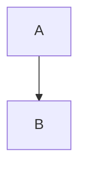

# Generated Documentation Assets

**Version:** 1.0.0
**Generated:** 2025-12-24

This directory contains auto-generated visualization assets for the Notes Dashboard documentation.

---

## Directory Structure

```
docs-by-notebooklm/generated/
├── README.md                    # This file
├── VISUAL_STYLE_GUIDE.md        # Design system reference
├── infographic_spec.json        # Structured infographic definitions
├── architecture_overview.mmd    # Mermaid: System architecture
├── invariants_and_guards.mmd    # Mermaid: Backend/frontend rules
├── upload_pipeline.mmd          # Mermaid: Upload sequence diagram
└── hero/
    ├── notes-dashboard-architecture-hero.png
    ├── invariants-hero.png
    └── upload-flow-hero.png
```

---

## 2-Tier Pipeline

### Tier 1: Truth Layer (Deterministic)

These assets are derived strictly from source documentation and can be regenerated deterministically:

| Asset | Source Files |
|-------|--------------|
| `VISUAL_STYLE_GUIDE.md` | CONSTITUTION.md, VERIFICATION_REPORT.md |
| `infographic_spec.json` | All governance docs |
| `architecture_overview.mmd` | CONSTITUTION.md Article III |
| `invariants_and_guards.mmd` | CONSTITUTION.md Articles I-II |
| `upload_pipeline.mmd` | VERIFICATION_REPORT.md |

### Tier 2: Beauty Layer (AI-Generated)

Hero infographics are generated via the `nanobanana` MCP server using Gemini image models:

| Asset | Prompt Source |
|-------|---------------|
| `notes-dashboard-architecture-hero.png` | infographic_spec.json[0] |
| `invariants-hero.png` | infographic_spec.json[1] |
| `upload-flow-hero.png` | infographic_spec.json[2] |

---

## Regeneration Instructions

### Prerequisites

1. Claude Code CLI with MCP support
2. `nanobanana` MCP server configured
3. Access to source documentation files

### Tier 1: Regenerate Mermaid Diagrams

Mermaid diagrams can be rendered using:

```bash
# Using mermaid-cli (mmdc)
npx -p @mermaid-js/mermaid-cli mmdc -i architecture_overview.mmd -o architecture_overview.svg

# Or view in VS Code with Mermaid extension
# Or paste into https://mermaid.live
```

### Tier 2: Regenerate Hero Infographics

Use the Visualization Upgrade Agent prompt:

```
You are Claude Code operating as a Visualization Upgrade Agent.

Goal: Regenerate hero infographics using nanobanana MCP.

Source: docs-by-notebooklm/generated/infographic_spec.json

Tasks:
1. Read infographic_spec.json for prompt specifications
2. Generate images using nanobanana.generate_image
3. Save to docs-by-notebooklm/generated/hero/

Style requirements:
- Clean vector NotebookLM aesthetic
- Flat UI, grid aligned
- Black / white / neutral accents
- No decorative clutter
- 3:4 aspect ratio
- 2K resolution
```

### Full Regeneration

To regenerate all assets from scratch:

1. Delete contents of `docs-by-notebooklm/generated/`
2. Run the full Visualization Upgrade Agent prompt
3. Verify outputs match infographic_spec.json definitions

---

## Source Documentation

All claims in generated assets must be traceable to these files:

| File | Content |
|------|---------|
| `CONSTITUTION.md` | System invariants and governance rules |
| `MASTER_PROMPT.md` | Claude Code workflow enforcement |
| `HIERARCHY_LOGIC.md` | Tree structure and position management |
| `DND_INTERACTION.md` | Drag-and-drop implementation details |
| `BACKEND_HIERARCHY_AUDIT.md` | Backend code audit findings |
| `VERIFICATION_REPORT.md` | Test results and fix documentation |
| `SYSTEM_AUDIT_2025-12-24.md` | Latest system audit |

---

## Rendering Mermaid Diagrams

### GitHub

Mermaid diagrams render automatically in GitHub markdown:

```markdown

```

### Local Rendering

```bash
# Install mermaid-cli
npm install -g @mermaid-js/mermaid-cli

# Render to PNG
mmdc -i diagram.mmd -o diagram.png -b transparent

# Render to SVG
mmdc -i diagram.mmd -o diagram.svg
```

### VS Code

Install the "Mermaid Preview" extension for live preview.

---

## Style Compliance

All generated assets must comply with `VISUAL_STYLE_GUIDE.md`:

- **Colors:** Use defined semantic palette
- **Typography:** Inter for text, JetBrains Mono for code
- **Spacing:** 8px base unit multiples
- **Icons:** Lucide React style (2px stroke, rounded caps)

---

## Modification Rules

**DO:**
- Update source documentation first, then regenerate
- Cite source files in infographic_spec.json
- Maintain consistent visual style

**DON'T:**
- Modify generated assets directly (they will be overwritten)
- Add claims not in source documentation
- Change aspect ratios or resolutions without updating spec

---

*Generated by Visualization Upgrade Agent*
